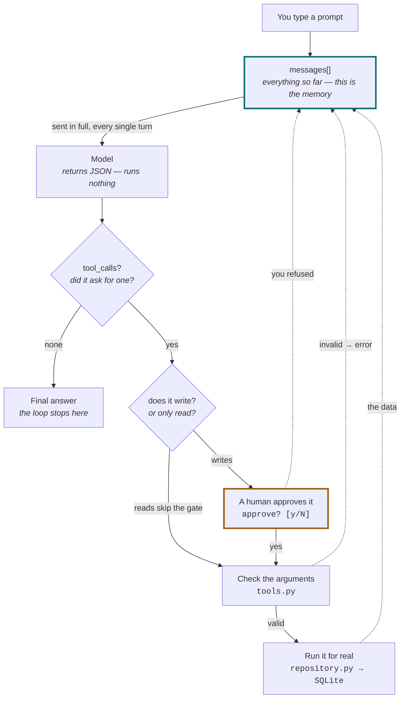

# Inside the Agent Loop

What actually happens between typing a prompt and getting an answer.

The short version: **the model never executes anything.** It returns JSON naming a
function it would like called, and this codebase decides whether to run it.

---

## The loop



Note what the three dotted lines have in common. Your refusal, a validation error and
real data are all just **results** — the model finds out what happened through the same
channel every time. That is why rejecting a proposal makes it re-plan instead of crash.

The loop is bounded by `MAX_TURNS = 8`, so a confused model cannot run forever.

---

## Step by step

### 1. Your words are appended to a list

Nothing clever happens yet. Your prompt becomes one item on the end of a Python list
that already holds the agent's instructions.

```python
messages = [
  {"role": "system", "content": SYSTEM_PROMPT},
  {"role": "user",   "content": "Look at T-1006 and assign it to the right department."},
]
```

> `run_raw.py` → `new_conversation()`

### 2. The whole list is sent, plus the tool menu

Every turn re-sends the entire conversation. The model is stateless — it remembers
nothing between calls. Alongside it go the JSON schemas describing the four tools,
which is the only way it learns they exist.

```python
client.chat.completions.create(
    model="llama3.1",
    messages=messages,        # the ENTIRE list, every time
    tools=TOOL_SCHEMAS,       # get_ticket, search_tickets, assign_department, add_note
)
```

> **This is what "memory" means.** Not a store the model reads from — a transcript
> replayed into its context on every call. The `[memory: 13 messages]` counter in the
> terminal is the length of a list. It is also why long conversations get slower,
> pricier, and start to drift.

### 3. The reply arrives in one of two channels

The response carries two separate fields, and which one the model uses decides
everything that follows.

| Field | Contains |
|---|---|
| `message.content` | prose for the human |
| `message.tool_calls` | structured requests to execute |

Empty `tool_calls` means the model is done talking, and the loop returns its text.
Otherwise the loop has work to do.

> **It still hasn't run anything.** It produced
> `{"name": "get_ticket", "arguments": "{\"ticket_id\": \"T-1006\"}"}` — a request, not
> an action. Small models fail here in a revealing way: when they write that JSON into
> `content` instead, nothing runs, because nothing was actually requested.
> `raw_agent.py` detects that case and says so.

### 4. Writes stop for a human. Reads don't.

Before anything executes, the loop checks the requested tool against `WRITE_TOOLS`.
Looking things up happens freely. Changing them waits for a person.

```
reads  →  get_ticket, search_tickets        straight through
writes →  assign_department, add_note       approval first

  ?? assign_department({"ticket_id": "T-1006", "department": "technical"})
     approve? [y/N]:
```

> **Say no and nothing is written.** The refusal is handed back to the model as a tool
> result, so it learns the action did not happen and proposes something else — rather
> than crashing, or quietly believing it succeeded.

> `raw_agent.py` → `_execute()`

### 5. Arguments are checked before they reach SQL

The model's arguments are untrusted input. They are checked against the same constants
the database enforces, and a failure returns a *string* rather than raising — so the
model can read it and correct itself.

```
error: 'finance' is not a valid department. Choose one of:
billing, technical, account, shipping.
```

That message names what was wrong **and** what would be right. An error saying only
"invalid department" leaves the model guessing, and it will guess wrong.

> `tools.py` → `assign_department()`

### 6. The result is appended, and the loop goes round

Whatever came back — the data, an `ok:`, an `error:`, or your refusal — is appended as
a tool result. Then step 2 happens again, with the model now able to see what its last
request actually produced.

```python
messages.append({
    "role": "tool",
    "tool_call_id": call.id,        # links back to the request
    "content": '{"id": "T-1006", "subject": "App crashes on export to PDF", ...}',
})
```

This is the whole trick. The model sees the consequence of its last decision and decides
again. That feedback step is the difference between an agent and a chatbot.

---

## How it ends

**Normal exit — no tool calls.** The model replies with prose and no requests. The loop
returns that text and stops. Most turns end here after one or two tool calls.

**Safety exit — turn cap reached.** `MAX_TURNS = 8`. A model stuck in a retry cycle burns
tokens and time; the cap returns a partial answer and a warning instead of running forever.

---

## The one line worth carrying away

The intelligence is in the model; the **agency** is in the loop. The model contributes one
decision per turn — the loop is what turns decisions into actions, feeds back the
consequences, and holds the gate where a human gets to say no.

Read [`helpdesk/raw_agent.py`](../helpdesk/raw_agent.py) — about sixty lines — and every
box in the diagram above is a statement you can point at.
